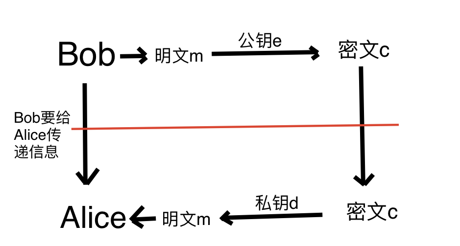

# RSA算法

RSA加密算法属于**非对称算法**。

使用场景如下图：

<div align="middle">



</div>

### 通信流程

Bob想要给Alice传递加密信息，他先用公钥e对明文m进行加密，然后通过公开的方式传递密文c。

Alice接收到密文c以后通过其私有的私钥d对密文c进行解密，还原明文m，从而得到信息。

### RSA通信流程和算法

1. 首先找两个质数```p```，```q```。

2. 计算n，另```n=p*q```。

3. 计算一个欧拉函数```f(n)=(p-1)*(q-1)```，确定该值```f(n)```。

4. 接收方Alice，生成公钥e 和 私钥d：

   1. 取公钥```e```为一个满足如下条件的整数
      - ```e```与```f(n)```互质。
      - ```1<e<f(n)```
   2. 取一个私钥```d```满足如下条件，使得
      - ```e*d```除以```f(n)```后余数为1
      - 例如，如果f(n)为20，e为3，那么就可以找到d，d=7。

5. Bob通过公钥e对明文m进行**加密**

   ```m^e除以n所得余数即为C```

6. Alice通过私钥对密文c进行**解密**

   ```C^d除以n所得余数即为m```

7. 通过验证5和6步骤是可以证明的。

### RSA的原理

1. 首先Alice生成了```公钥e```和```私钥d```

2. 她通过公开的方式传递```公钥e```给Bob，并同时传递Bob```大数字n```。

3. **安全性**保证：

   - 网络中传播的信息：```密文C```，```公钥e```，```大数字n```。**这些信息都存在风险**。

   - Alice拥有的信息：```密文C```，```公钥e```，```私钥d```，```大数字n```。私钥d是Alice唯一保留的没有风险的信息。

   - Bob拥有的信息：```明文m```，```公钥e```，```大数字n```，```通过公钥e加密后的密文C```。

     第三方若想对```密文C```进行解密，就必须知道```私钥d```。若要想知道```私钥d```，就只能通过生成e和d时的公式```e*d除以f(n)后余数为1```来得到。因而要想知道```私钥d```，就必须先知道```f(n)```，而```f(n)=(p-1)*(q-1)```，即必须先知道```p```和```q```。而第三方唯一知道的就是```大数字n=p*q```以及p和q是两个互质的数字。

     对于一个小数字，例如21，我们很容易能将其分解成两个质因数的积。但是对于一个大数字，要将其分解成两个质因数，则会有很高的时间复杂度。

     因而一般的RSA会采用1024或2048位加密算法。